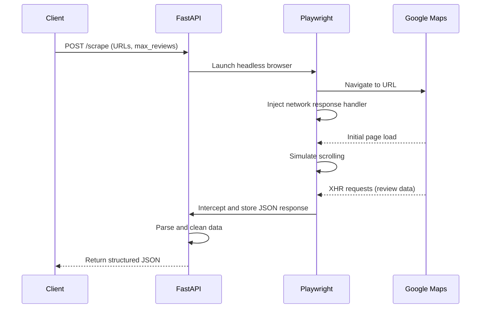

<h1 align="center">Fast AF Scraper</h1>

<p align="center">
  <strong>A high-speed, headless scraper that scrapes review data from Google Maps by intercepting network traffic. Served via a minimal FastAPI endpoint.</strong>
</p>

<p align="center">
    <a href="#features">Features</a> •
    <a href="#performance">Performance</a> •
    <a href="#system-architecture">Architecture</a> •
    <a href="#api-usage">API Usage</a> •
    <a href="#quick-start">Quick Start</a> •
    <a href="#disclaimer">Disclaimer</a>
</p>

---

## Features

*   **High-Speed Data Extraction**: Bypasses the DOM by intercepting XHR requests, achieving speeds of up to **100 reviews in approximately 8.5 seconds**.
*   **Asynchronous Architecture**: Built on `asyncio`, enabling non-blocking, concurrent scraping operations for maximum efficiency.
*   **Headless Operation**: Utilizes `Playwright` for robust, headless browser automation that mimics human interaction, ensuring compatibility with modern web applications.
*   **Scalable API**: Served via a `FastAPI` endpoint, allowing for concurrent requests and easy integration into production environments.
*   **Targeted Scraping**: Optional `max_reviews` parameter for precise control over the number of reviews to be extracted.
*   **Resilient and Lightweight**: Resource-efficient design with a focus on stability and performance.

## Performance

The network interception method provides a substantial performance advantage over traditional web scraping techniques. Here are some indicative metrics based on recent test runs:

| Reviews Requested | Time to Complete | Reviews per Second |
| :---------------- | :--------------- | :----------------- |
| 50                | ~6.9 seconds     | ~7.2               |
| 100               | ~8.5 seconds     | ~11.8              |

These metrics demonstrate the scraper's ability to efficiently scale its data extraction capabilities.

## System Architecture

The scraper operates through a multi-stage process, designed for speed and efficiency:

1.  **Request Initiation**: A POST request containing target URLs and an optional review limit is sent to the FastAPI endpoint.
2.  **Browser Orchestration**: Playwright launches a headless Chromium instance, configured to block non-essential resources like images and media.
3.  **Network Hooking**: A response handler is injected into the browser's network stack to specifically listen for JSON payloads from Google's internal API (`listugcposts`).
4.  **Interaction Simulation**: The scraper navigates to the target URL and simulates rapid scrolling to trigger the lazy-loading of reviews.
5.  **Data Interception**: As the browser requests and receives review data, the network hook captures the raw JSON responses before they are rendered on the page.
6.  **Data Aggregation & Sanitization**: The captured JSON is aggregated, parsed, and de-duplicated to produce a clean, structured dataset.
7.  **API Response**: The final, structured data is returned via the API endpoint.



## API Usage

### Endpoint

`POST /scrape`

### Request Body

```json
{
  "urls": ["<URL_1>", "<URL_2>", "..."],
  "max_reviews": 100
}
```

*   `urls` (required): A list of one or more Google Maps URLs to scrape.
*   `max_reviews` (optional): An integer specifying the maximum number of reviews to return.

### Example `curl` Request

```sh
curl -X POST "http://localhost:8000/scrape" \
-H "Content-Type: application/json" \
-d '{
      "urls": [
        "https://www.google.com/maps/place/Eiffel+Tower/@48.8583701,2.2944813,17z/data=!4m6!3m5!1s0x47e66e2964e34e2d:0x8ddca9ee380ef7e0!8m2!3d48.8583701!4d2.2944813!16zL20vMDI3ZHI?entry=ttu"
      ],
      "max_reviews": 50
    }'```

### Response Payload

```json
{
  "URL_HERE": {
    "status": "success",
    "count": 50,
    "reviews": [
      {
        "id": "ChdDS...S4",
        "name": "User Name",
        "date": "1 week ago",
        "rating": 5,
        "text": "Review text goes here..."
      }
    ]
  }
}
```

## Quick Start

### 1. Prerequisites

*   Python

### 2. Installation

Clone the repository and install the required dependencies:

```sh
git clone https://github.com/ikottiz/scraper.git
cd scraper
pip install -r requirements.txt
playwright install
```

### 3. Running the API Server

Launch the Uvicorn server to start the API:

```sh
uvicorn api:app --host 0.0.0.0 --port 8000
```

The API will now be available at `http://localhost:8000`.

## Disclaimer
This is for educational purposes. Scraping can violate ToS. Don't abuse it. You are responsible for your own actions.
